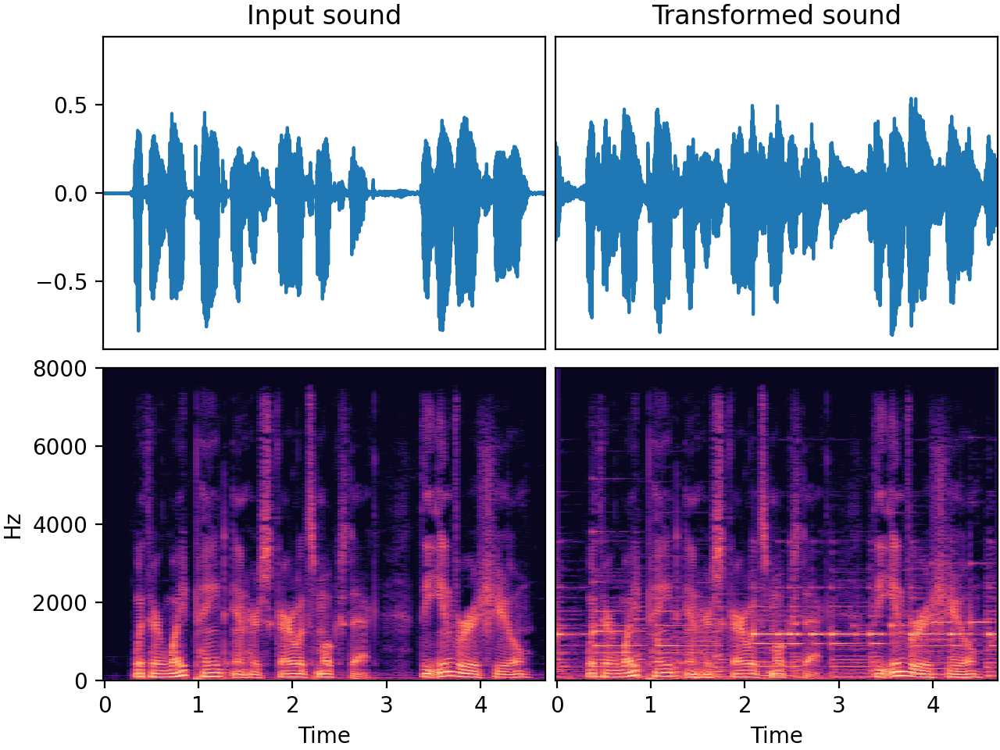

# `AddBackgroundNoise`

_Added in v0.9.0_

Mix in another sound, e.g. a background noise. Useful if your original sound is clean and
you want to simulate an environment where background noise is present.

Can also be used for [mixup :octicons-link-external-16:](https://arxiv.org/pdf/1710.09412.pdf){target=_blank} when training
classification/annotation models.

A path to a file/folder with sound(s), or a list of file/folder paths, must be
specified. These sounds should ideally be at least as long as the input sounds to be
transformed. Otherwise, the background sound will be repeated, which may sound unnatural.

Note that in the default case ([`noise_rms="relative"`](#noise_rms)) the gain of the added noise is
relative to the amount of signal in the input. This implies that if the input is
completely silent, no noise will be added.

Optionally, the added noise sound can be transformed (with [`noise_transform`](#noise_transform)) before it gets mixed in.

Here are some examples of datasets that can be downloaded and used as background noise:

* [https://github.com/karolpiczak/ESC-50#download :octicons-link-external-16:](https://github.com/karolpiczak/ESC-50#download){target=_blank}
* [https://github.com/microsoft/DNS-Challenge/ :octicons-link-external-16:](https://github.com/microsoft/DNS-Challenge/){target=_blank}

## Input-output example

Here we add some music to a speech recording, targeting a signal-to-noise ratio (SNR) of
5 decibels (dB), which means that the speech (_signal_) is 5 dB louder than the music (_noise_).



| Input sound                                                                               | Transformed sound                                                                               |
|-------------------------------------------------------------------------------------------|-------------------------------------------------------------------------------------------------|
| <audio controls><source src="../AddBackgroundNoise_input.flac" type="audio/flac"></audio> | <audio controls><source src="../AddBackgroundNoise_transformed.flac" type="audio/flac"></audio> | 

## Usage examples


=== "Relative RMS"

    ```python
    from audiomentations import AddBackgroundNoise, PolarityInversion
    
    transform = AddBackgroundNoise(
        sounds_path="/path/to/folder_with_sound_files",
        min_snr_in_db=3.0,
        max_snr_in_db=30.0,
        noise_transform=PolarityInversion(),
        p=1.0
    )
    
    augmented_sound = transform(my_waveform_ndarray, sample_rate=16000)
    ```

=== "Absolute RMS"

    ```python
    from audiomentations import AddBackgroundNoise, PolarityInversion
    
    transform = AddBackgroundNoise(
        sounds_path="/path/to/folder_with_sound_files",
        noise_rms="absolute",
        min_absolute_rms_in_db=-45.0,
        max_absolute_rms_in_db=-15.0,
        noise_transform=PolarityInversion(),
        p=1.0
    )
    
    augmented_sound = transform(my_waveform_ndarray, sample_rate=16000)
    ```

## AddBackgroundNoise API

[`sounds_path`](#sounds_path){ #sounds_path }: `Union[List[Path], List[str], Path, str]`
:   :octicons-milestone-24: A path or list of paths to audio file(s) and/or folder(s)
    with audio files. Can be str or Path instance(s). The audio files given here are
    supposed to be background noises.

[`min_snr_in_db`](#min_snr_in_db){ #min_snr_in_db }: `float` (unit: Decibel)
:   :octicons-milestone-24: Default: `3.0`. Minimum signal-to-noise ratio in dB. Is only
    used if `noise_rms` is set to `"relative"`

[`max_snr_in_db`](#max_snr_in_db){ #max_snr_in_db }: `float` (unit: Decibel)
:   :octicons-milestone-24: Default: `30.0`. Maximum signal-to-noise ratio in dB. Is
    only used if `noise_rms` is set to `"relative"`

[`noise_rms`](#noise_rms){ #noise_rms }: `str` (choices: `"absolute"`, `"relative"`)
:   :octicons-milestone-24: Default: `"relative"`. Defines how the background noise will
    be added to the audio input. If the chosen option is `"relative"`, the root mean
    square (RMS) of the added noise will be proportional to the RMS of the input sound.
    If the chosen option is `"absolute"`, the background noise will have an RMS
    independent of the rms of the input audio file

[`min_absolute_rms_in_db`](#min_absolute_rms_in_db){ #min_absolute_rms_in_db }: `float` (unit: Decibel)
:   :octicons-milestone-24: Default: `-45.0`. Is only used if `noise_rms` is set to
    `"absolute"`. It is the minimum RMS value in dB that the added noise can take. The
    lower the RMS is, the lower the added sound will be.

[`max_absolute_rms_in_db`](#max_absolute_rms_in_db){ #max_absolute_rms_in_db }: `float` (unit: Decibel)
:   :octicons-milestone-24: Default: `-15.0`. Is only used if `noise_rms` is set to
    `"absolute"`. It is the maximum RMS value in dB that the added noise can take. Note
    that this value can not exceed 0.

[`noise_transform`](#noise_transform){ #noise_transform }: `Optional[Callable[[np.ndarray, int], np.ndarray]]`
:   :octicons-milestone-24: Default: `None`. A callable waveform transform (or
    composition of transforms) that gets applied to the noise before it gets mixed in.
    The callable is expected to input audio waveform (numpy array) and sample rate (int).

[`p`](#p){ #p }: `float`
:   :octicons-milestone-24: Default: `0.5`. The probability of applying this transform.

[`lru_cache_size`](#lru_cache_size){ #lru_cache_size }: `int`
:   :octicons-milestone-24: Default: `2`. Maximum size of the LRU cache for storing noise files in memory
