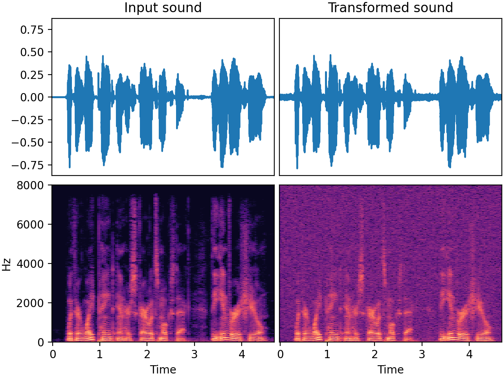

# `AddGaussianNoise`

_Added in v0.1.0_

Add gaussian noise to the samples

## Input-output example

Here we add some gaussian noise (with amplitude 0.01) to a speech recording.



| Input sound                                                                             | Transformed sound                                                                             |
|-----------------------------------------------------------------------------------------|-----------------------------------------------------------------------------------------------|
| <audio controls><source src="../AddGaussianNoise_input.flac" type="audio/flac"></audio> | <audio controls><source src="../AddGaussianNoise_transformed.flac" type="audio/flac"></audio> | 


## Usage example

```python
from audiomentations import AddGaussianNoise

transform = AddGaussianNoise(
    min_amplitude=0.001,
    max_amplitude=0.015,
    p=1.0
)

augmented_sound = transform(my_waveform_ndarray, sample_rate=16000)
```

## AddGaussianNoise API

[`min_amplitude`](#min_amplitude){ #min_amplitude }: `float` (unit: linear amplitude)
:   :octicons-milestone-24: Default: `0.001`. Minimum noise amplification factor.

[`max_amplitude`](#max_amplitude){ #max_amplitude }: `float` (unit: linear amplitude)
:   :octicons-milestone-24: Default: `0.015`. Maximum noise amplification factor.

[`p`](#p){ #p }: `float` (range: [0.0, 1.0])
:   :octicons-milestone-24: Default: `0.5`. The probability of applying this transform.
