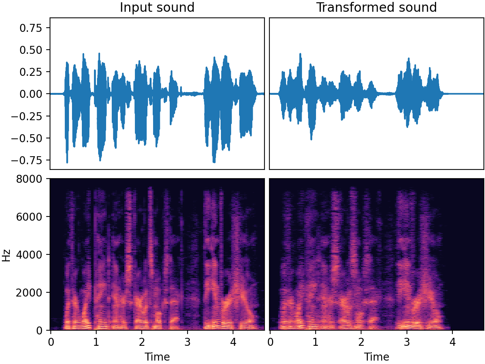

# `TimeStretch`

_Added in v0.2.0_

Change the speed or duration of the signal without changing the pitch. This augmentation employs `librosa.effects.time_stretch` in the backend to achieve the effect and also supports multichannel functionality. 


## Input-output examples



| Input sound                                                                             | Transformed sound                                                                             |
|-----------------------------------------------------------------------------------------|-----------------------------------------------------------------------------------------------|
| <audio controls><source src="../TimeStretch_input.flac" type="audio/flac"></audio> | <audio controls><source src="../TimeStretch_transformed.flac" type="audio/flac"></audio> |

## Usage example

```python
from audiomentations import TimeStretch

transform = TimeStretch(
    min_rate=0.8,
    max_rate=1.25,
    leave_length_unchanged=True,
    p=1.0
)

augmented_sound = transform(my_waveform_ndarray, sample_rate=16000)
```

## Trim API

[`min_rate`](#min_rate){ #min_rate }: `float`
:   :octicons-milestone-24: Default: `0.8`. Minimum rate of change of total duration of the signal.

[`max_rate`](#max_rate){ #max_rate }: `float`
:   :octicons-milestone-24: Default: `1.25`. Maximum rate of change of total duration of the signal.

[`leave_length_unchanged`](#leave_length_unchanged){ #leave_length_unchanged }: `bool`
:   :octicons-milestone-24: Default: `True`. The rate changes the duration and effects the samples. This flag is used to keep the total length of the generated output to be same as that of the input signal.

[`p`](#p){ #p }: `float` • range: [0.0, 1.0]
:   :octicons-milestone-24: Default: `0.5`. The probability of applying this transform.
